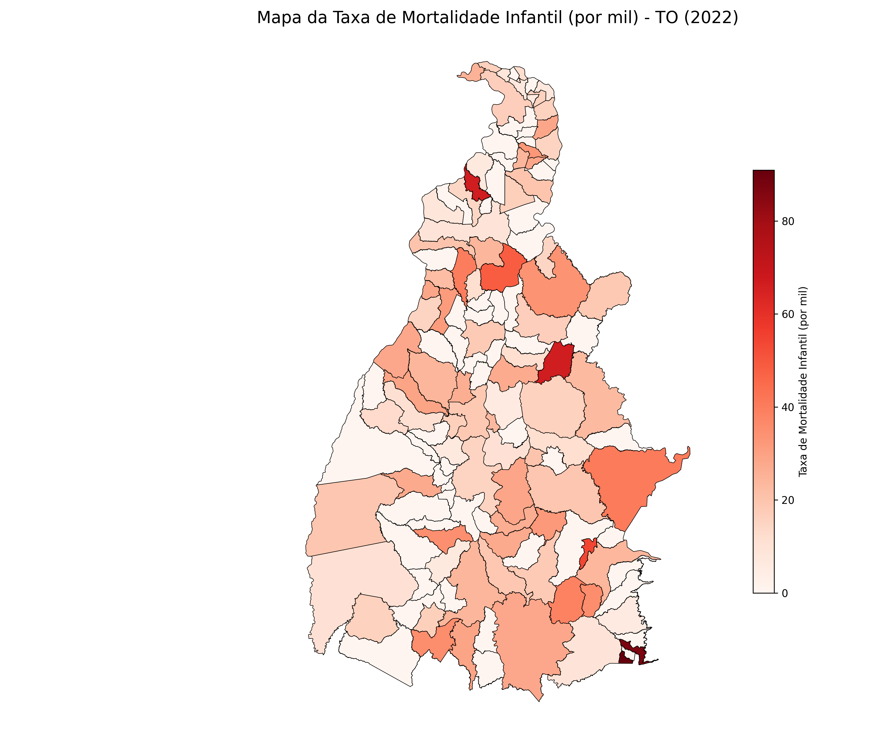
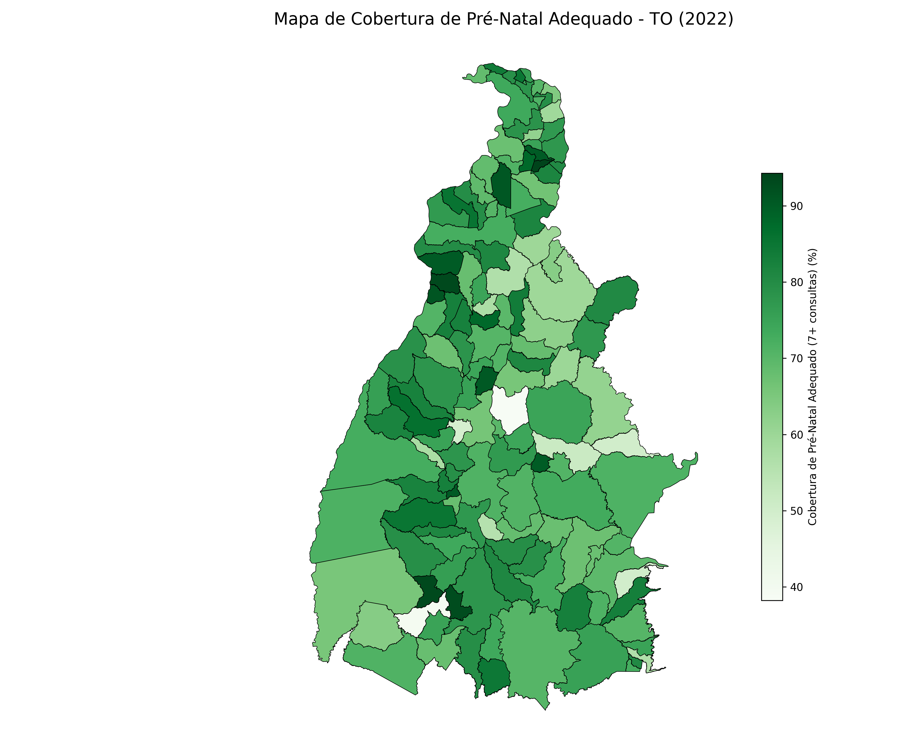
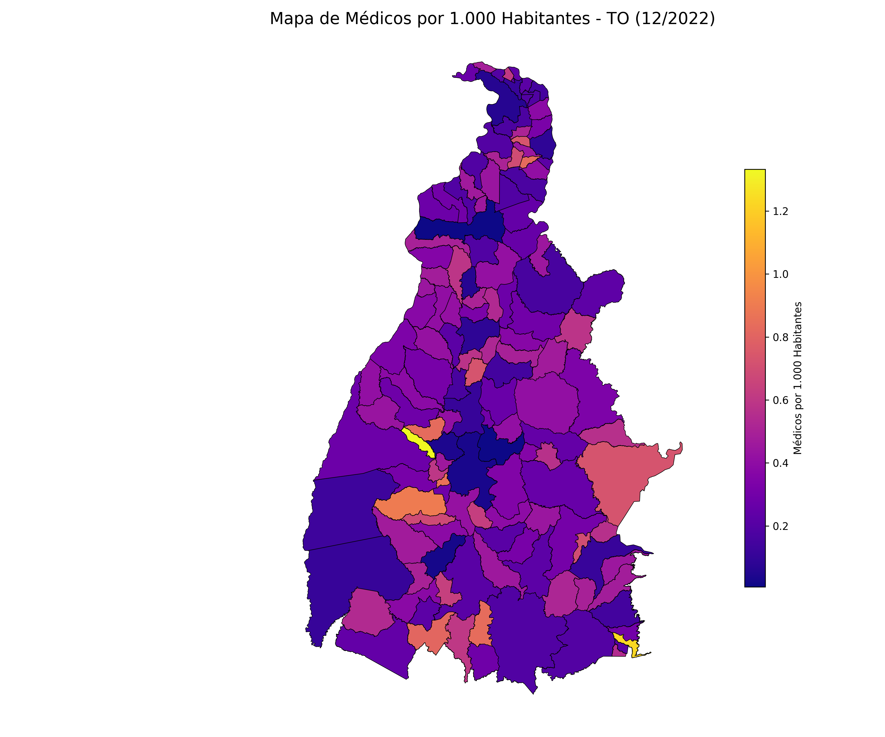
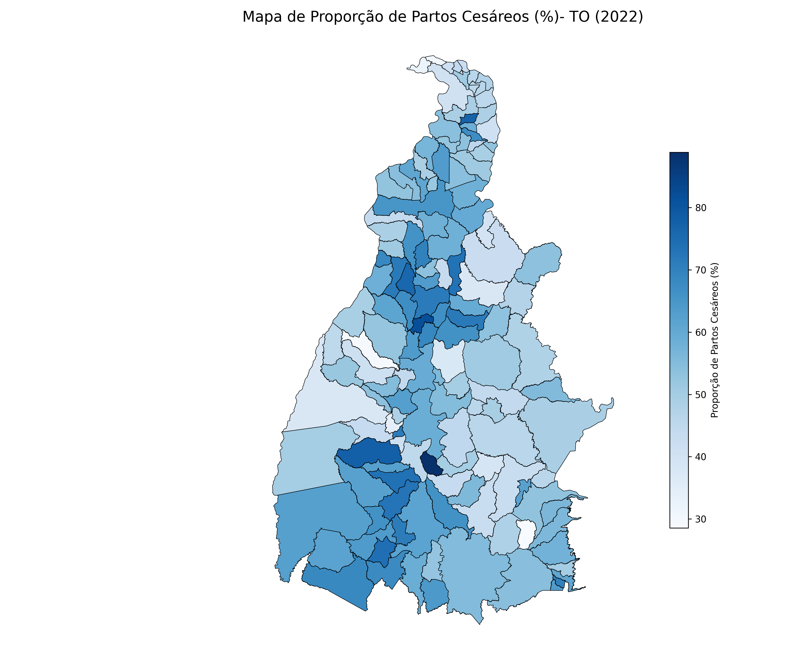
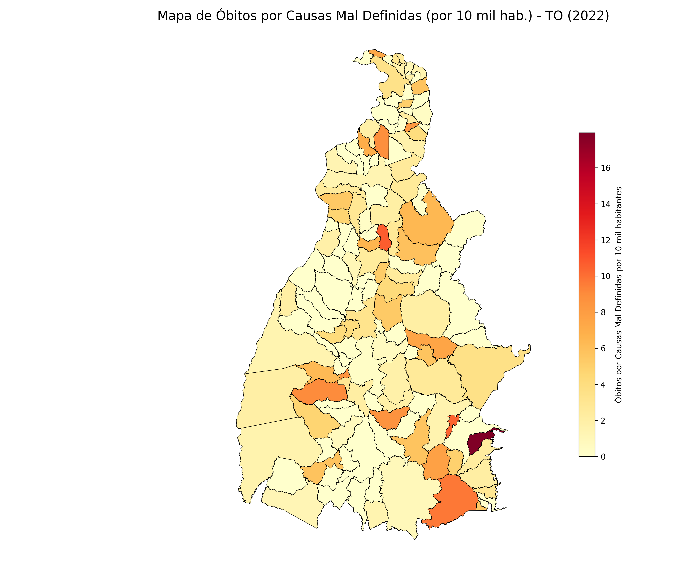
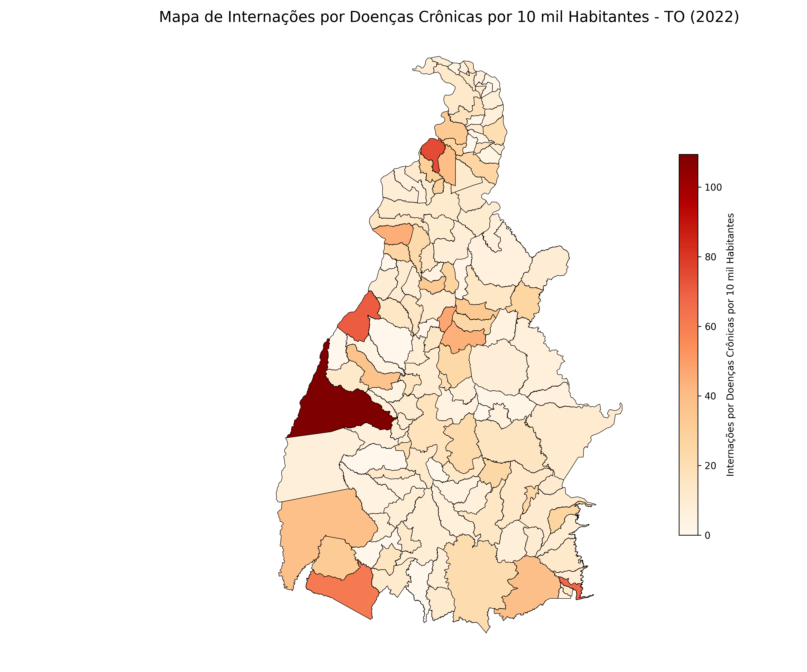
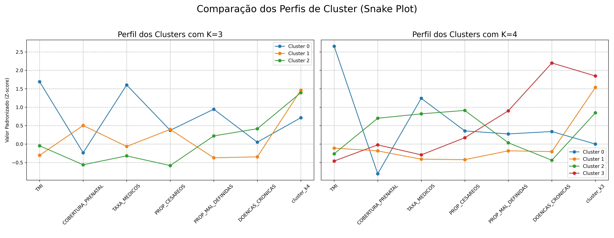

# Análise de Indicadores de Saúde e Clusterização de Municípios Brasileiros


Este projeto realiza um fluxo completo de análise de dados de saúde pública, desde a coleta automatizada de dados brutos de fontes governamentais até a aplicação de técnicas de machine learning para agrupar municípios brasileiros segundo seus perfis de saúde.

O objetivo é transformar dados públicos do DATASUS e IBGE em inteligência acionável, culminando na criação de um painel de indicadores consolidados e na segmentação dos municípios por estado do Brasil por meio do algoritmo K-Means.

---

## 🚀 Principais Funcionalidades

- **Coleta Automatizada de Dados:** Scripts para baixar dados diretamente dos sistemas do SUS (SIM, SINASC, CNES, SIH, SINAN).
- **Cálculo de Indicadores:** Automatiza o cálculo de indicadores de saúde fundamentais.
- **Consolidação de Dados:** Integra indicadores em um arquivo único CSV indexado por município.
- **Análise de Cluster (K-Means):** Agrupa municípios em perfis de vulnerabilidade/eficiência.
- **Visualização:** Gera mapas de calor, "Snake Plots" e outros gráficos para análise e apresentação dos resultados.

---

## 📊 Visualização dos Resultados para o Tocantins (2022)

A análise gera uma série de visualizações que permitem um diagnóstico completo da situação de saúde no estado.

### Mapas de Calor por Indicador

A análise inicial envolve a geração de mapas de calor (coropléticos) para cada indicador individual, permitindo uma visualização direta da distribuição geográfica de cada métrica.

| Taxa de Mortalidade Infantil | Cobertura de Pré-Natal Adequado |
| :---: | :---: |
|  |  |
| **Taxa de Médicos por 1.000 Habitantes** | **Proporção de Partos Cesáreos** |
|  |  |
| **Óbitos Mal Definidos por 10.000 Habitantes** | **Internações por Doenças Crônicas por 10.000 Habitantes** |
|  |  |

### Análise de Cluster (K-Means)

Aplicando o algoritmo K-Means, os municípios foram segmentados em grupos distintos com base em seus perfis de saúde. O mapa abaixo mostra a distribuição geográfica desses clusters, revelando "bolsões" de municípios com desafios e potencialidades semelhantes.


O "Snake Plot" a seguir detalha a "personalidade" de cada cluster, mostrando como a média de seus indicadores se desvia da média estadual, o que permite uma interpretação clara dos desafios e pontos fortes de cada grupo.



---

## 📚 Fontes de Dados

- SIM (Sistema de Informações sobre Mortalidade)
- SINASC (Sistema de Informações sobre Nascidos Vivos)
- CNES (Cadastro Nacional de Estabelecimentos de Saúde)
- SIH (Sistema de Informações Hospitalares)
- SINAN (Sistema de Informação de Agravos de Notificação)
- FTP do IBGE (Censo Demográfico 2022)

Todos os dados são públicos e obtidos via DATASUS e IBGE.

---

## ⚙️ Como Usar

1.  **Instale as dependências:**
    ```bash
    pip install -r requirements.txt
    ```
2.  **Baixe os Shapefiles:** Baixe os shapefiles dos municípios brasileiros (ano 2022) diretamente do [portal do IBGE](https://www.ibge.gov.br/geociencias/organizacao-do-territorio/malhas-territoriais/34774-malhas-digitais-2022.html?=&t=downloads) e coloque os arquivos na pasta `shapefiles/`.

3.  **Gere a Base Populacional:**
    ```bash
    python gerar_censo_2022.py
    ```
    > **Obs:** Este passo cria o arquivo `populacao_brasil_censo_2022_com_estado.csv`, que é essencial para os próximos scripts.

4.  **Execute o Orquestrador:**
    ```bash
    python orquestrador.py
    ```
    > Este script irá calcular todos os indicadores e gerar o arquivo `indicadores_integrados_tocantins_2022.csv`.

5.  **Execute a Análise de Cluster:**
    ```bash
    python analise_cluster.py
    ```
    > Este script lê o arquivo consolidado e gera as visualizações de análise.

---

## 🤝 Contribuindo

Contribuições são bem-vindas! Abra uma issue ou envie um pull request para sugestões, correções ou melhorias.

---

## 📄 Licença

Este projeto está sob a licença MIT. Veja o arquivo `LICENSE` para detalhes.
